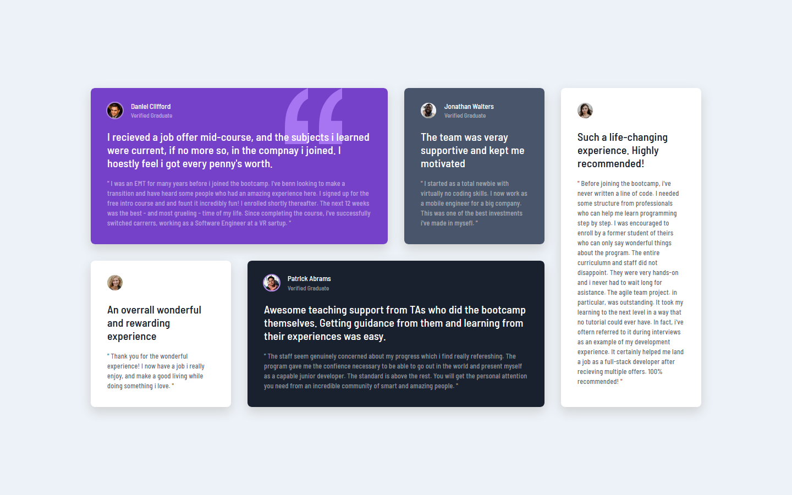

# Frontend Mentor - Testimonials grid section solution

This is a solution to the [Testimonials grid section challenge on Frontend Mentor](https://www.frontendmentor.io/challenges/testimonials-grid-section-Nnw6J7Un7). Frontend Mentor challenges help you improve your coding skills by building realistic projects. 

### Screenshot

### Links

- Solution URL: [https://github.com/rodolfomayora/testimonials-grid-section.git](https://github.com/rodolfomayora/testimonials-grid-section.git)
- Live Site URL: [https://rodolfomayora.github.io/testimonials-grid-section](https://rodolfomayora.github.io/testimonials-grid-section)

## My process
- TGS-0: project configuration
- TGS-1: define global styles and font
- TSG-2: define image assets index
- TGS-3: StudentPicture Component
- TGS-4: StudentInfo Component
- TGS-5: create ReviewBlockComponent
- TGS-6: TestimonialsGridSection component
- TSG-7: Deploy on Github Pages

### Built with

- Semantic HTML5 markup
- CSS Grid
- Mobile-first workflow
- [React](https://reactjs.org/) - JS library
- [TypeScript] (https://www.typescriptlang.org/) - JS Superset
- [CSS Modules](https://github.com/css-modules/css-modules) - For Scoped styles

## Author

- Website - [https://rodolfo-mayora-pereda.vercel.app](https://rodolfo-mayora-pereda.vercel.app)
- LinkedIn - [https://www.linkedin.com/in/rodolfo-mayora-pereda](https://www.linkedin.com/in/rodolfo-mayora-pereda)
- Frontend Mentor - [https://www.frontendmentor.io/profile/rodolfomayora](https://www.frontendmentor.io/profile/rodolfomayora)
